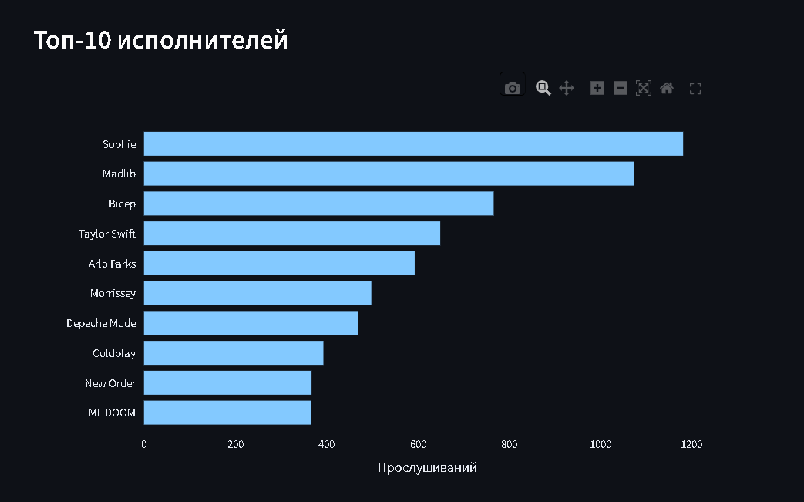
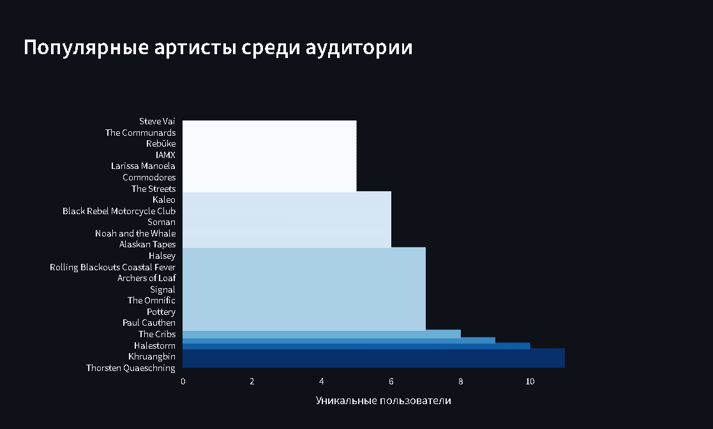
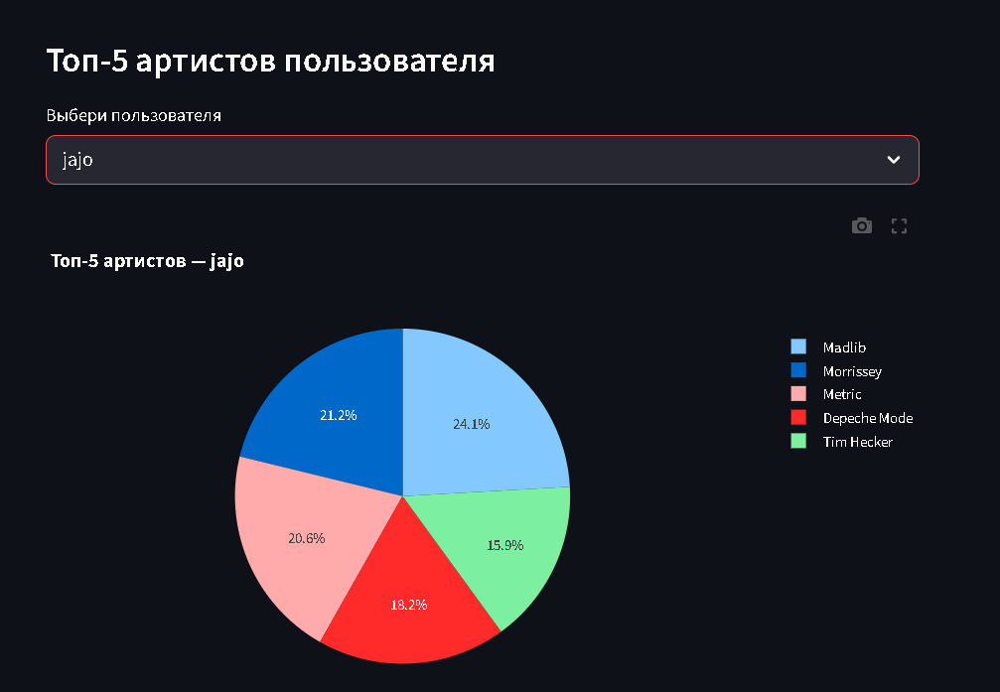
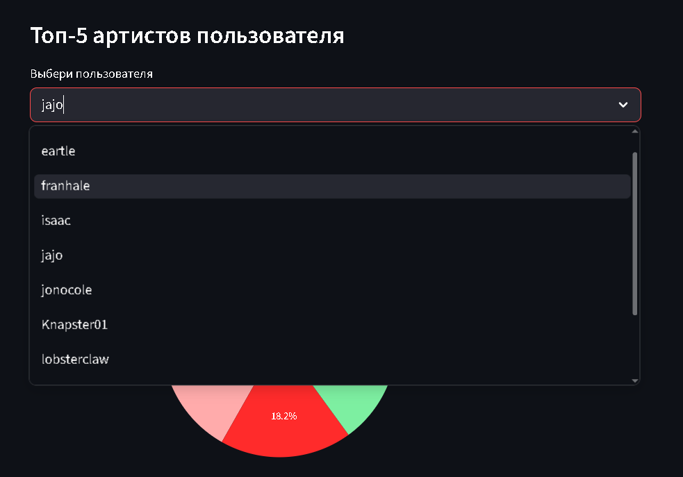
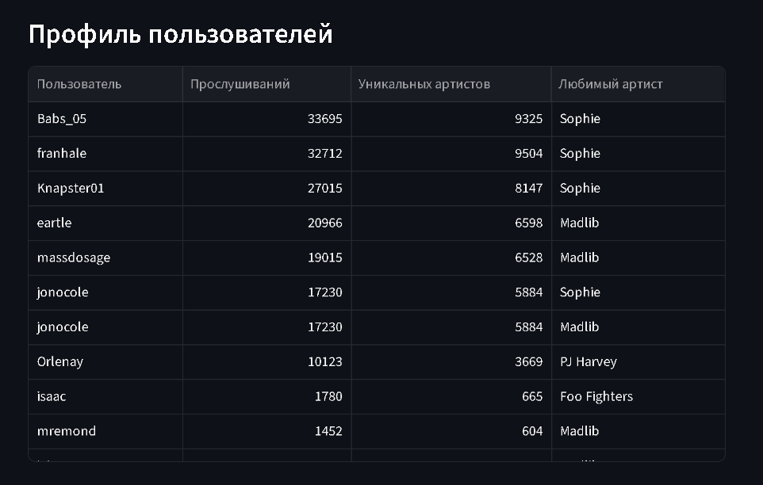

# 🎵 Last.fm Listening Analytics Dashboard

Интерактивный аналитический дашборд на **Streamlit + PostgreSQL** для анализа слушательского поведения пользователей Last.fm.

**[Открыть дашборд](https://lastfmdashboard-drazsapp5ffyj3vu3n8kvcw.streamlit.app/)**

---

## 📊 Что внутри

| Блок | Описание |
|---|---|
| Общая статистика | 166 153 прослушивания, 11 пользователей, 22 823 уникальных артиста |
| Топ-10 исполнителей | Рейтинг артистов по числу прослушиваний |
| Топ-10 композиций | Самые популярные треки с указанием артиста |
| Профиль пользователей | Прослушивания, уникальные артисты и любимый исполнитель для каждого юзера |
| Дневная активность | Динамика прослушиваний по дням января 2021 |
| Активность по дням недели | Распределение прослушиваний по дням недели |
| Популярные артисты | Исполнители, которых слушают ≥5 из 11 пользователей |
| Топ-5 артистов пользователя | Интерактивный выбор пользователя — доля каждого артиста в % |

---

## 🛠 Стек

- **PostgreSQL** — хранение и обработка данных (166k записей)
- **SQL** — оконные функции (`ROW_NUMBER`, `SUM OVER PARTITION BY`), агрегации, `HAVING`, CTE, `JOIN`
- **Python** — `psycopg2`, `pandas`
- **Streamlit** — интерактивный веб-дашборд
- **Plotly** — визуализации

---

## 🚀 Запуск локально

1. Клонируйте репозиторий:
```bash
git clone https://github.com/drshtopor/lastfm-dashboard
cd lastfm-dashboard
```

2. Установите зависимости:
```bash
pip install -r requirements.txt
```

3. Создайте файл `.env` с параметрами подключения:
```
DATABASE_URL=your_neon_connection_string
```

4. Запустите дашборд:
```bash
streamlit run app.py
```

---

## 📁 Структура репозитория

```
├── app.py              # Streamlit-дашборд
├── queries.sql         # Все SQL-запросы проекта
├── requirements.txt    # Зависимости
└── README.md
```

---

## 📸 Скриншоты







---

## 📂 Данные

Датасет: Last.fm скробблинги 11 пользователей за январь 2021.  
Источник: [Kaggle — Last.fm Dataset](https://www.kaggle.com/datasets/harshal19t/lastfm-dataset)
